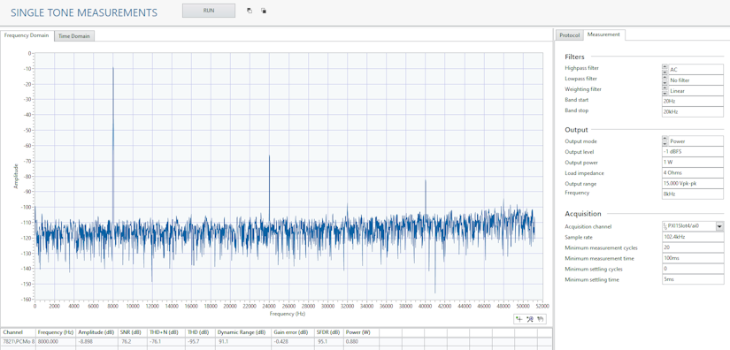
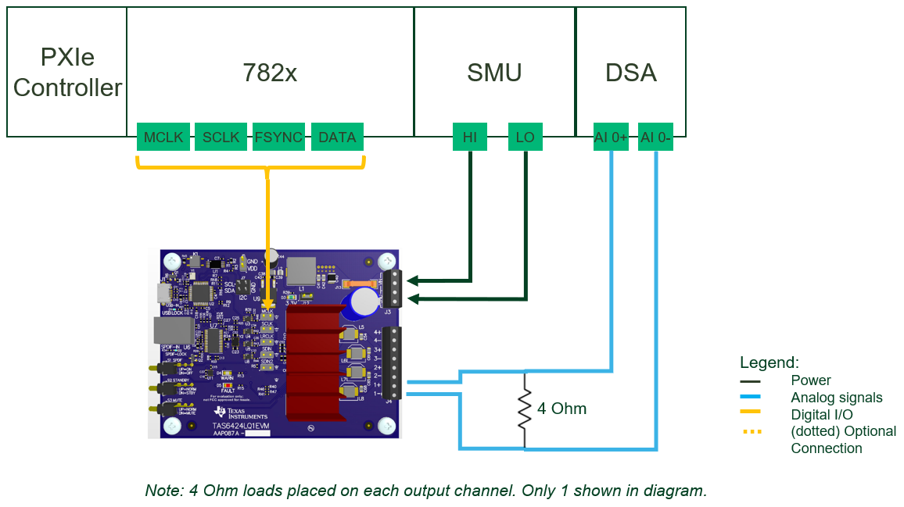

# Class D Amplifier Measurements

This plug-in makes measurements for Class D amplifiers. The tests will generate a digital audio signal and then measure the analog output of the amplifier.

## Key Features

- Generates digital audio signal
  - I2S
  - PCM
  - TDM
- Single tone measurements
  - THD
  - THD+N
  - SNR
  - SFDR
  - Dynamic range
  - Gain error
  - Output power
- Crosstalk
- Stepped Frequency Sweep
- Efficiency
- Efficiency Sweep

Click here for a detailed list of measurements and their functionality: [Measurement List](docs/measurements/meas-index.md)

## Hardware Setup

Instrumentation:

- NI Dynamic Signal Acquisition device (NI 446x)
- NI 7820/21
- SMU or power supply (note: the software does not use the SMU/power supply but need something to power the DUT)

Tested hardware setup:

- NI 4468
- NI 7821
- NI 4139
- TAS6424 evaluation board
- Load resistors

## Software Installation

(*This section is if you only want to use the pre-compiled plug-ins. If you want to open the source code, go to [software development](docs/sw-dev.md).*)  
Install from NI Package Manager:

- NI RIO (2024 Q1 or greater)
- NI DAQmx (2024 Q1 or greater)
- NI DCPower (if using NI SMU to power device)
- InstrumentStudio (2024 Q1 or greater)
- MeasurementLink (2024 Q1 or greater)

Download the latest NI package from the releases section of this repo or add the feed to NI Package Manager to get updates from this repo and other in this community. To use the NI Package Manager feeds, refer to this: [Subscribing to package feeds](https://github.com/NI-MeasurementLink-Plug-Ins/package-manager-feeds)

## Getting Started

When you are ready to start using the software, check out [this](docs/help.md).

## Contributing

Use the instructions in [software development](docs/sw-dev.md) for setting up a development environment and overview of the code.
