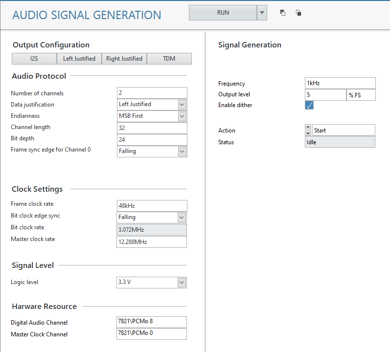

# Audio Signal Generation

This service will generate a continuous audio signal.

## Signal Types

- Sine Wave

## Digital Audio

Refer to [Digital Audio Serial Interface](../measurements/common/digital-serial.md) for details on how to setup the digital audio interface.

## InstrumentStudio Panel

### Usage

In the Output Configuration section, enter the details for your digital communication settings. In the Signal Generation section, enter the details of the sine wave to generate. Use the **Action** control to start, stop, or update the signal. Press the **RUN** button to for your selections to be active.  

#### Tips

- If the generation is already running and you want to make updates, you can keep the **Action** as *Start* and the generation will update (not stop and restart).
- If you want the digital clocks to keep running but no signal to be generated, set the amplitude to 0 %FS.
