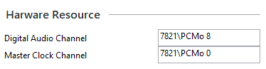
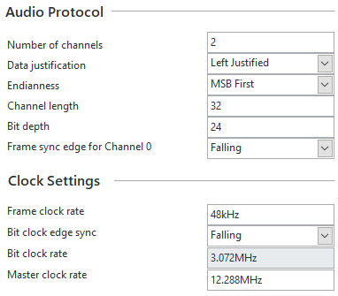

# Digital Serial Interface

The digital serial interfaces (such as I2S and TDM) are implemented with the Digital Audio Acquisition and Generation Toolkit. Many of the details of the supported protocols can be found in the help documentation of the toolkit.

## Pin Assignments

Before connecting signals to your DUT, you need to know which digital lines from your instrumentation to connect. The following documents describe which pins the digital serial pins are assigned to.

[PXIe-7820/7821](https://www.ni.com/docs/en-US/bundle/digital-audio-acquisition-generation/page/connector-pin-pxie-7820-7821-pcm-acq-gen.html)

[USB-7845/7846](https://www.ni.com/docs/en-US/bundle/digital-audio-acquisition-generation/page/connector-pin-usb-7845-7846-pcm-acq-gen.html)

## Channel Nomenclature

When specifying the which channels to use, there are two parts to the channel name. The first one is the name of the device as it appears in NI-MAX. The second one is the specific channel being used.

In the example above, the PXIe-7821's name in NI-MAX is ***7821***. The Digital Audio Channel uses PCM Data Line 8 and generates on signals on all of the channels on that data line. If you only wanted to generate data on a single data line, you could use the channel name ***PCMo 8.0***. Note that the "o" in the channel name stands for *output*. Each bank of pins has a data line, bit clock, and frame sync clock associated with it.

**Important Note**: The master clock **must** be on a different **bank** than the digital audio channel. Use the Bit Clock pin from the selected bank as the master clock.

The following documents show the channel mapping:

[PXIe-7820/7821 Channel Mapping](https://www.ni.com/docs/en-US/bundle/digital-audio-acquisition-generation/page/specs-pcm-bank-map-pxie-7820-7821.html)

[USB-7845/7846 Channel Mapping](https://www.ni.com/docs/en-US/bundle/digital-audio-acquisition-generation/page/specs-pcm-bank-map-usb-7845-7846.html)

## Digital Serial Parameters

Not sure how to set some of these digital serial parameters.

Refer to this document for some typical configurations and timing diagrams.

[Different Digital Serial Interface Types](https://www.ni.com/docs/en-US/bundle/digital-audio-acquisition-generation/page/acquire-generate-signal-different-interface.html)

## Specifications

Interested in some of the details like the number of I2S channels supported on a data line or the maximum bit clock rate, then check out the specifications:

[PCM Specifications](https://www.ni.com/docs/en-US/bundle/digital-audio-acquisition-generation/page/specs-pcm-acq-gen.html)