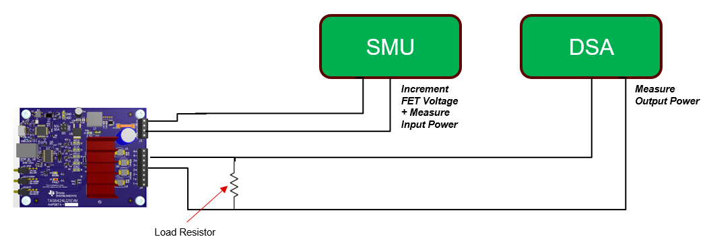
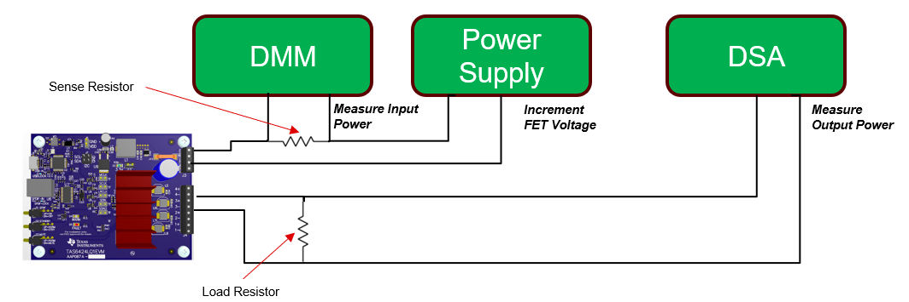

# Efficiency Measurement Techniques
There are two methods provided to measure efficiency. One technique uses a SMU to provide power and also measure the current consumption. The other technique uses a power supply to power the DUT while a DMM with a sense resistor measures the current consumption.

## SMU Option
Hardware configuration: 
In this mode, the SMU is used to provide power the DUT as well as measure the input power. 

## DMM and Power Supply Option
Hardware configuration: 
In this mode, the power supply powers the DUT while the DMM measures the input current by measuring the voltage drop across a sense resistor. A typical sense resistor would be of size 0.010 Ohms.
