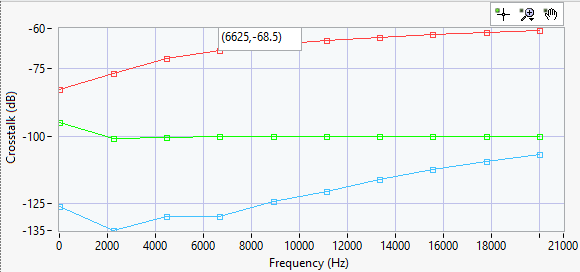
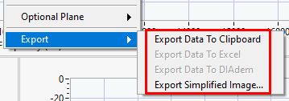

# Graph Features

## Show Plot Values

In XY plots, you can hover over the plots with you mouse to see the exact value at the mouse location. This works for the actual data point and also interpolates in between data points on the same plot.

## Exporting Data

To export data from a graph, right-click on the graph and select one of these options:

[Exporting Data and Images help](https://www.ni.com/docs/en-US/bundle/labview/page/exporting-data-and-images.html)
