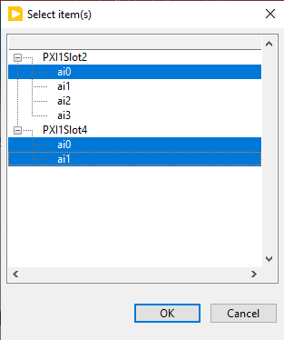

# Selecting Multiple Channels
You can select multiple channels to acquire from by using the drop down selector.  
  
To select a single channel, click on it. To select multiple, choose the *Browse..* option. This will open a dialog that will let you select multiple channels either by selecting a parent device in the tree, Ctrl + click, or Shift + click.
