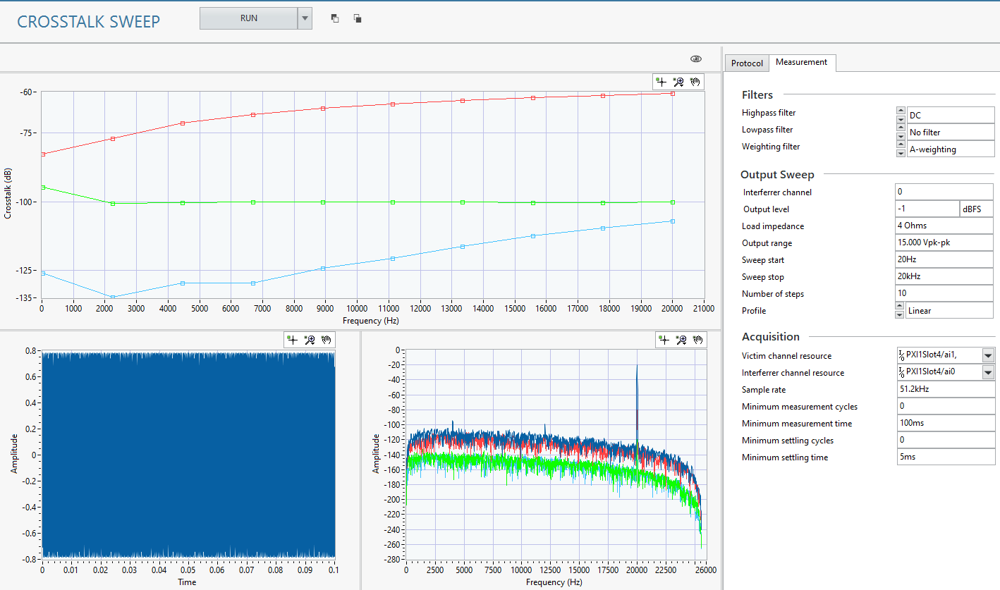
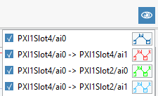

# Crosstalk Sweep

This service measures the crosstalk from one interferrer channel to one or more victim channels across a range of frequencies.

## Digital Audio

Refer to [Digital Audio Serial Interface](../measurements/common/digital-serial.md) for details on how to setup the digital audio interface.

## InstrumentStudio Panel

### Usage

In the Output Configuration section, enter the details for your digital communication settings. In the Measurement section, enter the information for the crosstalk measurement.  

#### Tips

- You can select multiple victim channels to measure crosstalk at once. Refer to [Selecting Multiple Channels](common/select-multiple-daqmx-channels.md) for details.
- You can select which channels to view in the graph by pressing the *View* button. The first channel in the list is the interferrer channel and the others are the victims. There is no crosstalk plot for the interferrer channels. 
- Check out [Graph features](../measurements/common/graph-features.md) for built-in functions of the graphs.
