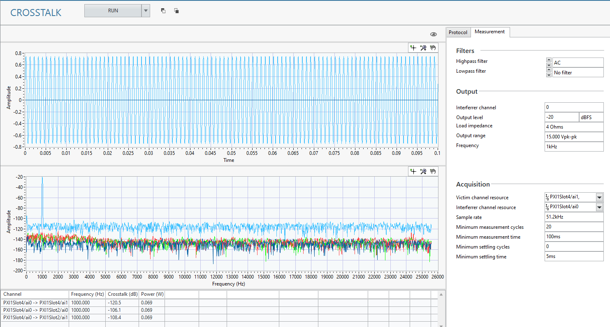
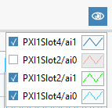

# Crosstalk
This service measures the crosstalk from one interferrer channel to one or more victim channels. 

## InstrumentStudio Panel
### Usage
In the Output Configuration section, enter the details for your digital communication settings. In the Measurement section, enter the information for the crosstalk measurement.  

#### Tips: 
- You can select multiple victim channels to measure crosstalk at once. Refer to [Selecting Multiple Channels](common/select-multiple-daqmx-channels.md) for details.
- You can select which channels to view in the graph by pressing the *View* button.  
