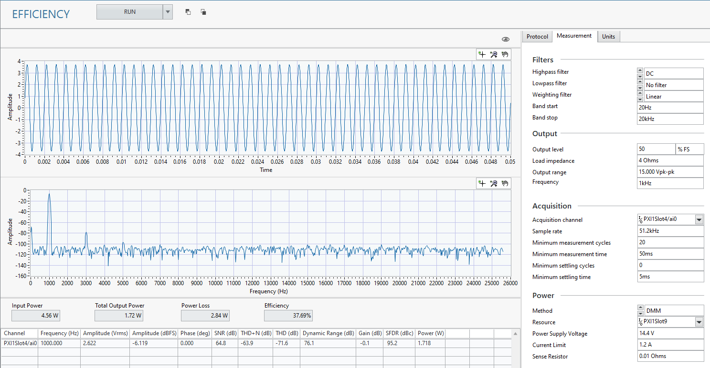

# Efficiency
This service measures the efficiency of the amplifier at a specified output level and frequency. Two different methods for measuring efficiency are supported. Read up on these methods at [Efficiency Measurement Techniques](common/efficiency-measurement.md)

## Digital Audio
Refer to [Digital Audio Serial Interface](../measurements/common/digital-serial.md) for details on how to setup the digital audio interface.

## InstrumentStudio Panel
### Usage

In the Output Configuration section, enter the details for your digital communication settings. For the Power settings, you can select the measurement method you are using.  

When using the SMU method, the sense resistor is not needed and that value from software is ignored. When using the DMM method, the power supply voltage is the voltage of the programmed power supply. This voltage is not measured but is used to determine the input power to the DUT.

