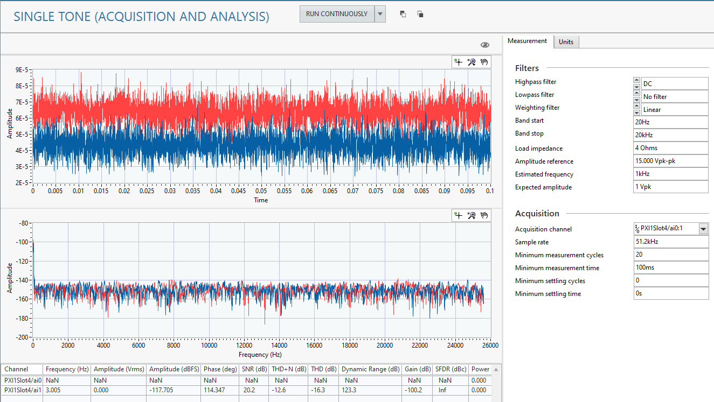

# Single Tone (Acquisition and Analysis)
This service acquires an analog signal from a DAQmx supported device and performs single tone analysis.

## InstrumentStudio panel
### Usage
Configure your acquisition and analysis settings in the **Measurements** tab. You can also adjust the units the measurements are reported in on the **Units** tab.

#### Tips
- You can analyze multiple channels at the same time by adding them to the *Acquisition channel* control. Refer to [Selecting Multiple Channels](common/select-multiple-daqmx-channels.md) for details.
- For a live update, consider using the *Continuous Run* feature of InstrumentStudio: [Continuous Run](common/IS-continuous-run.md).

