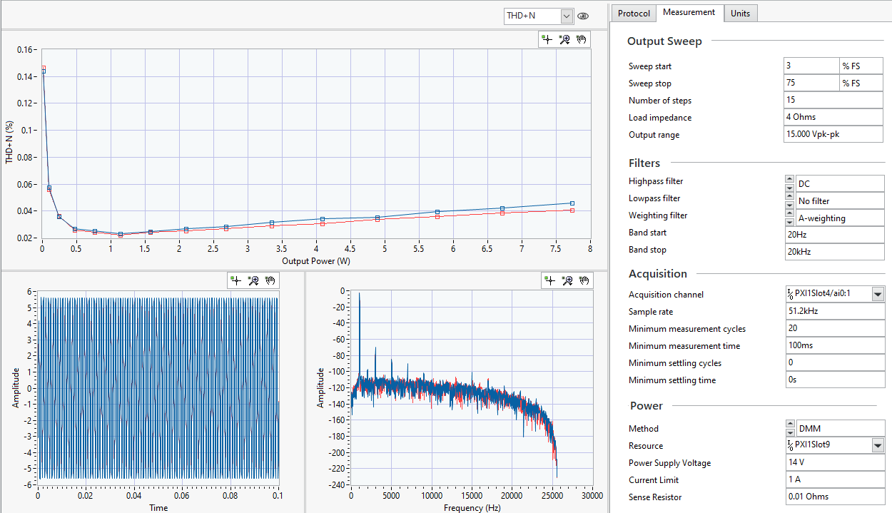
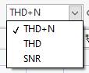

# Single Tone vs Power Sweep

This service measures the AC response of the DUT at a specific frequency across a range of output power levels. This can be used to generates plots like THD+N vs output power.

## Digital Audio

Refer to [Digital Audio Serial Interface](../measurements/common/digital-serial.md) for details on how to setup the digital audio interface.

## InstrumentStudio panel

### Usage

Configure your acquisition and analysis settings in the **Measurements** tab. You can also adjust the units the measurements are reported in on the **Units** tab.

#### Tips

- Use the *View* button to see data from different channels.
- Use the pull down control above the graph to select different measurements to display. Only one at a time is available.

- Check out [Graph features](../measurements/common/graph-features.md) for built-in functions of the graphs.
