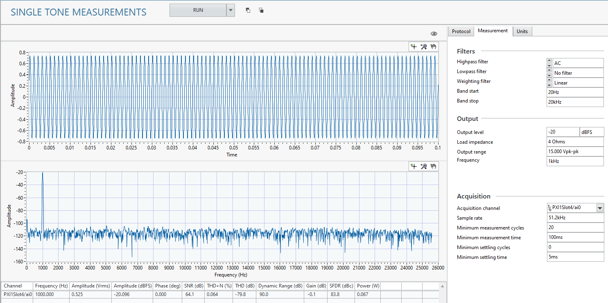
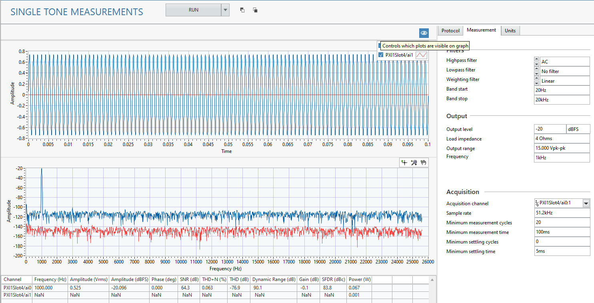

# Single Tone
This service generates a single tone digital signal, acquires the analog output, and analyzes the data.

## InstrumentStudio panel
### Usage
Configure your acquisition and analysis settings in the **Measurements** tab. You can also adjust the units the measurements are reported in on the **Units** tab.

#### Tips
- You can analyze multiple channels at the same time by adding them to the *Acquisition channel* control. Refer to [Selecting Multiple Channels](common/select-multiple-daqmx-channels.md) for details.  
