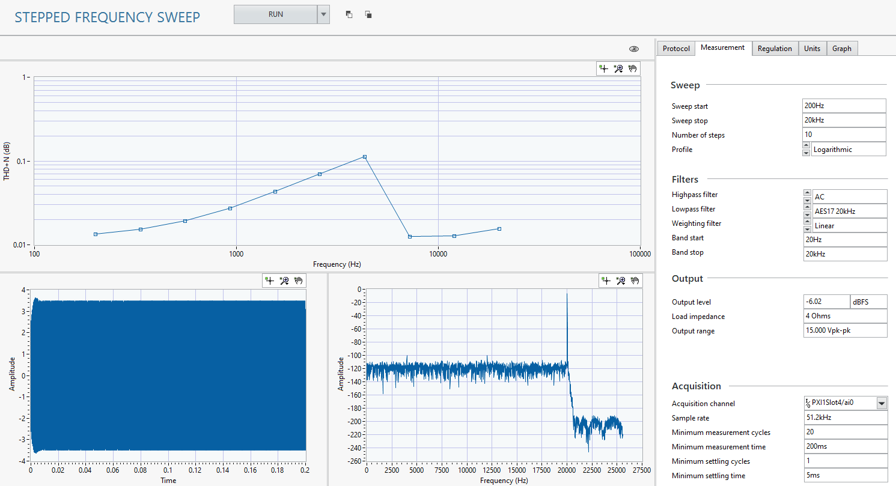

# Stepped Frequency Sweep
This service measures the AC response of the DUT across a range of frequencies. It will generate, acquire, and analyze a single tone signal and then move on the the next frequency.

## InstrumentStudio panel
### Usage
Configure your acquisition and analysis settings in the **Measurements** tab. You can also adjust the units the measurements are reported in on the **Units** tab.

#### Tips
- Use the *View* button to see different results in the sweep graph.